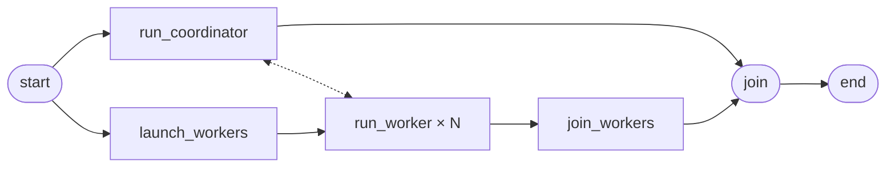

# metaflow-coordinator

[](https://github.com/npow/metaflow-coordinator/actions/workflows/ci.yml) [](https://pypi.org/project/metaflow-coordinator/) [](LICENSE) [](https://www.python.org/downloads/)

Give your parallel Metaflow workers a shared service — work queues, rate limiters, barriers, Redis, Postgres, custom APIs — that runs inside the flow and tears down when the run ends.

## How it works

The coordinator step runs a service that workers discover and call while both run concurrently. When workers finish, the service tears itself down automatically.



## The problem

When you fan out to N parallel worker steps, those workers share nothing. There's no built-in way for them to pull from a shared queue, throttle concurrent API calls, or stream results back to the coordinator. The usual answer is Redis or a database — real infrastructure for a temporary need that exists only for the duration of one run.

## Coordination patterns

Ten patterns cover the full range of worker↔coordinator interactions. Each has a runnable example in `examples/`.

| # | Pattern | Use when… | Example |
|---|---------|-----------|---------|
| 1 | **Work Queue** | Tasks are heterogeneous; workers should self-assign the next available item | `work_queue.py` |
| 2 | **Broadcast + Consensus** | Every worker gets the same input; you want majority vote or best-of-N | `agent_ensemble.py` |
| 3 | **Shared Mutable State** | Workers have overlapping sub-problems; share a cache to skip redundant work | `shared_cache.py` |
| 4 | **Synchronization Barrier** | Workers run in rounds and must wait for each other before continuing | `gradient_aggregator.py` |
| 5 | **Adaptive Search** | Prune low-performing candidates between rounds (tournament / successive halving) | `tournament.py` |
| 6 | **Rate Limiter** | Workers call a rate-limited API; enforce ≤ N concurrent requests across the fleet | `rate_limiter.py` |
| 7 | **External Process** | Need Redis, nginx, DuckDB, or any binary — not just a Python service | `shard_server.py` |
| 8 | **Priority Queue** | Tasks have priorities; high-priority work should jump the queue dynamically | `priority_queue.py` |
| 9 | **Staged Pipeline** | Work flows through ordered stages; homogeneous workers handle any stage | `staged_pipeline.py` |
| 10 | **Nested Coordinators** | Sub-groups of workers each need their own independent coordinator | `nested_coordinators.py` |
| 11 | **Redis Cache** | Workers share an in-memory cache; avoid redundant computation across the fleet | `redis_cache.py` |
| 12 | **Postgres Results** | Workers write to a shared table; coordinator queries top-k results via SQL | `postgres_results.py` |

## Quick start

```bash
pip install metaflow-coordinator
# For AWS Batch / Kubernetes (URL exchange via S3):
pip install "metaflow-coordinator[s3]"
```

A coordinator step runs a service; worker steps discover and call it. Both run concurrently inside the same flow.

```python
from metaflow import FlowSpec, current, step
from metaflow_coordinator import (
    CompletionTracker, FastAPIService, await_service,
    coordinator_join, worker_join,
)

class MyFlow(FlowSpec):

    @step
    def start(self):
        self.coordinator_id = current.run_id
        self.worker_ids = list(range(4))
        self.next(self.run_coordinator, self.launch_workers)

    @step
    def run_coordinator(self):
        tracker = CompletionTracker(n_workers=4)
        app = FastAPI()
        results = {}

        @app.post("/submit")
        async def submit(body: dict):
            results[body["worker_id"]] = body["value"]

        FastAPIService(app=app, done=tracker.done).run(
            service_id=self.coordinator_id, namespace="my-flow"
        )
        self.results = results
        self.next(self.join)

    @step
    def launch_workers(self):
        self.next(self.run_worker, foreach="worker_ids")

    @step
    def run_worker(self):
        url = await_service(self.coordinator_id, namespace="my-flow", timeout=60)
        httpx.post(f"{url}/submit", json={"worker_id": self.input, "value": 42})
        httpx.post(f"{url}/complete")
        self.next(self.join_workers)

    @step
    @worker_join
    def join_workers(self, inputs):
        self.next(self.join)

    @step
    @coordinator_join
    def join(self, inputs):
        self.next(self.end)

    @step
    def end(self):
        print(self.results)
```

See [`examples/echo_service.py`](examples/echo_service.py) for the full runnable version.

## Usage

### Work Queue

```python
@step
def run_coordinator(self):
    wq = WorkQueue(items=my_records, drain_delay=2.0)
    wq.run(service_id=self.coordinator_id, namespace="my-flow")
    self.results = wq.results
    self.next(self.join)

@step
def run_worker(self):
    url = await_service(self.coordinator_id, namespace="my-flow", timeout=60)
    while True:
        item = httpx.post(f"{url}/pull", json={}).json()
        if item["done"]:
            break
        httpx.post(f"{url}/submit", json={"item_id": item["item_id"], "result": process(item["payload"])})
    self.next(self.join_workers)
```

### Rate Limiter

```python
@step
def run_coordinator(self):
    SemaphoreService(max_concurrent=5, n_workers=self.n_workers).run(
        service_id=self.coordinator_id, namespace="my-flow"
    )
    self.next(self.join)

@step
def run_worker(self):
    url = await_service(self.coordinator_id, namespace="my-flow", timeout=60)
    httpx.post(f"{url}/acquire")     # blocks until a slot is free
    result = call_rate_limited_api()
    httpx.post(f"{url}/release")
    httpx.post(f"{url}/done")
    self.next(self.join_workers)
```

### External process (Redis, Postgres, nginx, DuckDB, …)

`ProcessService` wraps any binary. The `url_scheme` parameter controls the URL workers receive — `"redis"` gives `redis://host:port`, `"postgresql"` gives `postgresql://host:port`, etc. Workers connect with their native client.

```python
# @conda installs the redis-server binary
@conda(packages={"redis": "7.2"})
@step
def run_coordinator(self):
    tracker   = CompletionTracker(n_workers=self.n_workers)
    redis_svc = ProcessService(
        command=["redis-server", "--port", "{port}"],
        done=tracker.done,
        url_scheme="redis",
    )
    SessionServiceGroup({"redis": redis_svc, "tracker": tracker}).run(
        service_id=self.coordinator_id, namespace="my-flow"
    )
    self.next(self.join)

@pypi(packages={"redis": "5.0"})
@step
def run_worker(self):
    import redis
    urls = discover_services(self.coordinator_id, roles=["redis", "tracker"],
                             namespace="my-flow", timeout=120)
    r = redis.Redis.from_url(urls["redis"])
    r.set("key", "value")
    httpx.post(f"{urls['tracker']}/complete")
    self.next(self.join_workers)
```

See [`examples/redis_cache.py`](examples/redis_cache.py) and [`examples/postgres_results.py`](examples/postgres_results.py) for full working examples.

### Built-in services

```python
from metaflow_coordinator import (
    CompletionTracker,   # fires done when N workers call POST /complete
    ResultCollector,     # fires done when N workers call POST /submit; stores results
    BarrierService,      # synchronization barrier across R rounds
    WorkQueue,           # pull-based task distribution
    SemaphoreService,    # concurrency limiter
)
```

## Core API

### Service types

```python
from metaflow_coordinator import FastAPIService, ProcessService, SessionServiceGroup

FastAPIService(app=my_app, done=done_event, drain_delay=2.0).run(
    service_id=self.coordinator_id, namespace="my-flow"
)

ProcessService(
    command=["redis-server", "--port", "{port}"],
    done=tracker.done,
    url_scheme="redis",           # workers receive redis://host:port
    ready=HttpReady(path="/health"),
)

SessionServiceGroup({"redis": redis_svc, "tracker": tracker}).run(
    service_id=self.coordinator_id, namespace="my-flow"
)
```

### Service discovery

```python
from metaflow_coordinator import await_service, discover_services

url  = await_service(self.coordinator_id, namespace="my-flow", timeout=120)
urls = discover_services(self.coordinator_id, roles=["redis", "tracker"],
                         namespace="my-flow", timeout=120)
```

### Join decorators

```python
from metaflow_coordinator import coordinator_join, worker_join

@step
@coordinator_join          # handles merge_artifacts for the coordinator/workers join
def join(self, inputs):
    self.next(self.end)

@step
@worker_join               # handles merge_artifacts for foreach-reduce steps
def join_workers(self, inputs):
    self.results = [inp.result for inp in inputs]
    self.next(self.join)
```

## Remote execution

Add `@batch` or `@kubernetes` to coordinator and worker steps. Service URLs are exchanged via S3 automatically — no VPC changes needed as long as coordinator and workers share a VPC. Install the S3 extra to enable this:

```bash
pip install "metaflow-coordinator[s3]"
```

## Development

```bash
git clone https://github.com/npow/metaflow-coordinator.git
cd metaflow-coordinator
pip install -e ".[dev]"
pytest -v
```

## License

Apache 2.0 — see [LICENSE](LICENSE).
